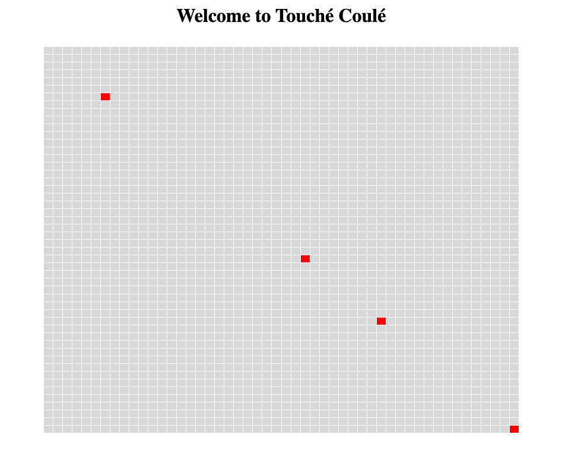

## Projet BlockChain - Touché Coulé [DAAR]

### Membre 

---

BOUAOUD Malik - 21105730 - M2 STL ING

KAYA Delphine - 3800099 - M2 STL ING

---

### Développement

Pour ce projet, nous devions coder une application simulant le jeu touché coulé en utilisant la blockChain Etherum. 

Nous avons codé un contrat contracts/MyShip.sol héritant de  contracts/Ship.sol. 

#### Contract MyShip. 
Le contrat a deux paramètres entiers, qui représente la position des bateaux que nous récupérons lors de leurs placement sur la grille grâce à la fonction **place**, la fonction place les bateaux de manière aléatoire en respectant le fait que les position choisirent soit à l'intérieur du **board game**. 

Ensuite nous avons codé la fonction update qui permet de changer les coordonnées du bateau. 

Et enfin, la fonction **Fire**, elle permet de tirer sur un bateau, on a deux possibilités de tirer. La première consiste à tirer dans les coordonnées inverse du bateau courrant, si il est à (34,20) alors le tir arrivera à la position (20,34). 

La seconde possibilité ressemble un peu à **place** puisqu'on tire aléatoirement en respectant les dimensions de la grille de jeu. 

#### Déploiement 

Une fois le contrat codé, il a fallu le déployer en s'inspirant du déploiement du contrat main. Le contrat se déploie sur une adresse. 

#### Enregistrement du contrat MyShip dans Main

Pour réaliser cette étape, nous avons modifier **Frontend/app.tsx** dans la partie onClick, on appelle Register du main en lui passant en paramètre l'adresse du contrat que l'on récupère dans **Lib/Main.ts** du dossier Frontend. 

#### Gameplay

---

**!! Attention !!**  Pour avoir plus de deux bateaux il faut plus de deux comptes métamask sinon la fonction register ne fonctionnera pas après le placement du second bateau. 

---

Du coup chaque compte a droit à deux bateaux. Une fois les bateaux placés on peut commencer à jouer en appuyant sur turn. 

Le fait d'utiliser notre méthode de tire implique que la cible n'est atteinte que rarement puisqu'on a de l'aléa.

Nous n'avons pas trouvé de moyen pour que le contrat MyShip ait accès au information du contract main pour récupérer par exemple les position des bateaux au alentours pour pouvoir leur tirer dessus. 

    
  
 

